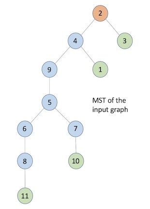

# Spanning Tree Based Termination Detection

## Introduction
There are many spanning tree based termination detection algorithms in the distributed systems literature. Of all of them below mentioned are shortlisted for analysis:
>- Rodney. W. Topor
>- Chandrashekhar Venkatesan
>- R.K Arora & M.N Gupta

> Rodney.W.Topor <Introduction ... TODO>  
> Chandrashekhar Venkatesan <Introduction ... TODO>  
> R.K Arora & M.N Gupta <Introduction ... TODO>  

## Solution Approach
>- Using Kruskal's algorithm for constructing a MST from a given graph, using "Union-Find" data structure
>- Using OpenMPI framework for simulating the distributed environment.
>- Each process will denote as a node in the MST.
>- **<... TODO ...\>**

## Environment Details
> Operating System:  _Mac OSX / Linux_  
> Package Installer : _Homebrew/apt-get_  
> Compiler : _mpic++_  
> Scripting : _python3_  
> Additonal Packages : _OpenMPI_  

## Source Tree
>- Given below is the source tree for the current project.
>```
> ├── Makefile
> ├── README.md
> ├── bin
> │   └── README.md
> ├── design
> │   └── STBTD_Design.docx
> ├── obj
> │   └── README.md
> ├── run_td.py
> ├── src
> │   ├── README.md
> │   ├── Graph.cpp
> │   ├── Graph.h
> │   ├── Node.cpp
> │   ├── Node.h
> │   ├── TerminationDetection.cpp
> │   ├── TerminationDetection.h
> │   └── main.cpp
> └── test
>     ├── README.md
>     ├── input_1.txt
>     └── input_2.txt
>
> 5 directories, 17 files
>```

>- './src/' : Directory containing all the source code & utility files.
>- './obj/' : Directory containing all temporary object files.
>- './bin/' : Directory containing the executable binary files.
>- './test/' : Directory containing the test data
>- Graph.h/cpp : A class implementing the graph algorithm for computing Minimum Spanning Tree.
>- Node.h/cpp  : A class defining the Process Node and its internal methods.
>- TerminationDetection.h/cpp : Files having all the computations/algorithms for termination detection.
>- main.cpp : File having the main() function from the program is initiated.

## Input Data Format & Execution Runs

**_Sample input file format:_**
>```
> #####################################################
> # Input file format for the creation of graph
> # <no_of_nodes>
> # <source_vertex> <destination_vertex> <edge_weight>
> # <source_vertex> <destination_vertex> <edge_weight>
> # ...
> #####################################################
> 11
> 1 2 10
> 1 3 7
> 1 4 6
> 2 3 4
> 2 4 3
> 2 5 8
> 2 6 11
> 3 8 6
> 4 9 5
> 5 6 5
> 5 7 5
> 5 9 2
> 6 8 2
> 6 11 13
> 7 10 6
> 7 11 9
> 8 11 7
> 9 10 17
>```

<p align="center">
  
</p>

**_Sample Execution Run:_**
>- Use the wrapper script **run_td.py** to build and execute the binaries.
>- Go to the implementation directory and run the following command  
> **./run_td.py <input_file\>**
>
>```
> $ ./run_td.py test/input_1.txt
> [INFO] Building binaries ...
> [MAKE] Cleaning all the object files and binaries.
> [MAKE] Compiled src/Graph.cpp successfully.
> [MAKE] Compiled src/Node.cpp successfully.
> [MAKE] Compiled src/TerminationDetection.cpp successfully.
> [MAKE] Linking Complete.
> [INFO] No of Nodes in the given graph: 11
> [INFO] Initiating Termination Detection with 12 processes (1 process per node and 1 additional master/manager process).
> [INFO] MASTER Process configuring and setting the process(s) environment
> [INFO] Displaying MST of the given graph as an Adjacency List:
> 1 -> 4
> 2 -> 4,3
> 3 -> 2
> 4 -> 2,9,1
> 5 -> 9,6,7
> 6 -> 8,5
> 7 -> 5,10
> 8 -> 6,11
> 9 -> 5,4
> 10 -> 7
> 11 -> 8
> [INFO] Root Node: 2
> [INFO] Node[10] is done with internal computations
> [INFO] LeafNode[10] initiating Termination Detection
> [INFO] Node[4] is done with internal computations
> [INFO] Node[5] is done with internal computations
> [INFO] Node[6] is done with internal computations
> [INFO] Node[11] is done with internal computations
> [INFO] LeafNode[11] initiating Termination Detection
> [INFO] Node[2] is done with internal computations
> [INFO] Node[9] is done with internal computations
> [INFO] Node[3] is done with internal computations
> [INFO] LeafNode[3] initiating Termination Detection
> [INFO] RootNode[2] Received Token[1] from ChildNode[3]
> [INFO] Node[1] is done with internal computations
> [INFO] LeafNode[1] initiating Termination Detection
> [INFO] InternalNode[4] Received Token[1] from ChildNode[1]
> [INFO] Node[8] sent a COMPUTE message to Node[7]
> [INFO] Node[8] is done with internal computations
> [INFO] InternalNode[8] Received Token[1] from ChildNode[11]
> [INFO] InternalNode[8] Received all tokens from child nodes. Sending Token[0] to ParentNode[6]
> [INFO] InternalNode[6] Received Token[0] from ChildNode[8]
> [INFO] InternalNode[6] Received all tokens from child nodes. Sending Token[0] to ParentNode[5]
> [INFO] InternalNode[5] Received Token[0] from ChildNode[6]
> [INFO] Node[7] is done with internal computations
> [INFO] InternalNode[7] Received Token[1] from ChildNode[10]
> [INFO] InternalNode[7] Received all tokens from child nodes. Sending Token[1] to ParentNode[5]
> [INFO] InternalNode[5] Received Token[1] from ChildNode[7]
> [INFO] InternalNode[5] Received all tokens from child nodes. Sending Token[0] to ParentNode[9]
> [INFO] InternalNode[7] Received the COMPUTE message from Node[8]
> [INFO] InternalNode[9] Received Token[0] from ChildNode[5]
> [INFO] InternalNode[9] Received all tokens from child nodes. Sending Token[0] to ParentNode[4]
> [INFO] InternalNode[4] Received Token[0] from ChildNode[9]
> [INFO] InternalNode[4] Received all tokens from child nodes. Sending Token[0] to ParentNode[2]
> [INFO] RootNode[2] Received Token[0] from ChildNode[4]
> [INFO] RootNode[2] Received a BLACK token. Initiating REPEAT Signal
> [INFO] RootNode[2] Sent REPEAT Signal to ChildNode[4]
> [INFO] RootNode[2] Sent REPEAT Signal to ChildNode[3]
> [INFO] InternalNode[4] Received a REPEAT request from ParentNode[2]
> [INFO] InternalNode[4] Forwarding REPEAT signal to ChildNode[9]
> [INFO] InternalNode[4] Forwarding REPEAT signal to ChildNode[1]
> [INFO] LeafNode[1] Received a REPEAT request from ParentNode[4]
> [INFO] LeafNode[1] initiating Termination Detection
> [INFO] RootNode[2] Received Token[1] from ChildNode[3]
> [INFO] LeafNode[3] Received a REPEAT request from ParentNode[2]
> [INFO] LeafNode[3] initiating Termination Detection
> [INFO] InternalNode[4] Received Token[1] from ChildNode[1]
> [INFO] InternalNode[5] Received a REPEAT request from ParentNode[9]
> [INFO] InternalNode[5] Forwarding REPEAT signal to ChildNode[6]
> [INFO] InternalNode[5] Forwarding REPEAT signal to ChildNode[7]
> [INFO] InternalNode[9] Received a REPEAT request from ParentNode[4]
> [INFO] InternalNode[9] Forwarding REPEAT signal to ChildNode[5]
> [INFO] InternalNode[6] Received a REPEAT request from ParentNode[5]
> [INFO] InternalNode[6] Forwarding REPEAT signal to ChildNode[8]
> [INFO] InternalNode[7] Received a REPEAT request from ParentNode[5]
> [INFO] InternalNode[7] Forwarding REPEAT signal to ChildNode[10]
> [INFO] InternalNode[7] Received Token[1] from ChildNode[10]
> [INFO] InternalNode[7] Received all tokens from child nodes. Sending Token[1] to ParentNode[5]
> [INFO] InternalNode[8] Received a REPEAT request from ParentNode[6]
> [INFO] InternalNode[8] Forwarding REPEAT signal to ChildNode[11]
> [INFO] InternalNode[8] Received Token[1] from ChildNode[11]
> [INFO] InternalNode[8] Received all tokens from child nodes. Sending Token[1] to ParentNode[6]
> [INFO] LeafNode[10] Received a REPEAT request from ParentNode[7]
> [INFO] LeafNode[10] initiating Termination Detection
> [INFO] InternalNode[5] Received Token[1] from ChildNode[7]
> [INFO] InternalNode[5] Received Token[1] from ChildNode[6]
> [INFO] InternalNode[5] Received all tokens from child nodes. Sending Token[1] to ParentNode[9]
> [INFO] InternalNode[6] Received Token[1] from ChildNode[8]
> [INFO] InternalNode[6] Received all tokens from child nodes. Sending Token[1] to ParentNode[5]
> [INFO] LeafNode[11] Received a REPEAT request from ParentNode[8]
> [INFO] LeafNode[11] initiating Termination Detection
> [INFO] RootNode[2] Received Token[1] from ChildNode[4]
> [INFO] RootNode[2] Received all tokens from child nodes
> [INFO] InternalNode[4] Received Token[1] from ChildNode[9]
> [INFO] InternalNode[4] Received all tokens from child nodes. Sending Token[1] to ParentNode[2]
> [INFO] InternalNode[9] Received Token[1] from ChildNode[5]
> [INFO] InternalNode[9] Received all tokens from child nodes. Sending Token[1] to ParentNode[4]
> [INFO] Termination Detection completed
> $
>```

**_Trace Messages:_**
>```
> [INFO]  -> Informational traces
> [MAKE]  -> Build traces
> [ERROR] -> Error traces
> [USAGE] -> Command usage
>```
