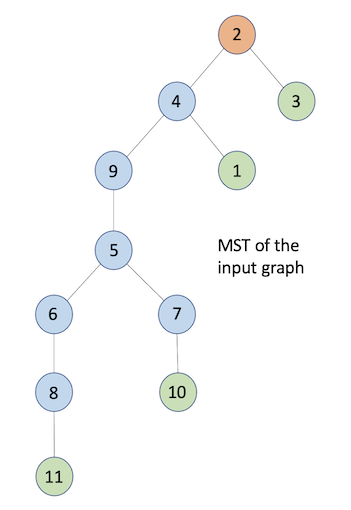

# Spanning Tree Based Termination Detection

## Introduction
There are many spanning tree based termination detection algorithms in the distributed systems literature. Of all of them we have shortlisted the following three algorithms for analysis:
>- Rodney. W. Topor
>- Chandrashekhar Venkatesan
>- R.K Arora & M.N Gupta

Below mentioned is the brief introduction on the above three algorithms.

> **Rodney.W.Topor**  
> Each leaf process after it has terminated, sends its token to its parent. When a parent process terminates and after it has received a token from each of its children, it sends a token to its parent. This way, each process indicates to its parent process that the sub-tree below it has terminated. In a similar manner, the tokens get propagated to the root. The root of the tree concludes that termination has occurred, after it has received a token from each of its children. In order to enable the root node to know that a node in its children’s sub-tree, that was assumed to be terminated, has become active due to a message, a coloring scheme for tokens and nodes is used. All tokens are initialized to WHITE. If a process had sent a message to some other process, it sends a BLACK token to its parent on termination, otherwise, it sends a WHITE token on termination.

> **Chandrashekhar Venkatesan**  
>

> **R.K Arora & M.N Gupta**  
>

## Solution Approach
> **Configuration**
>- For “N” nodes we create (N+1) OpenMPI processes.
>- Process with Rank=0 will be a master/manager process.
>- Processes with ranks 1 to N will represent N nodes of the MST.
>- As naming convention, we call master/manager process as MASTER and others as WORKER processes respectively.
>- In OpenMPI, we only use MPI_COMM_WORLD communicator for blocking send and receive communications between processes.
>- Messages supported: MSG_CONFIG, MSG_DONE, MSG_KILL, MSG_COMPUTE, MSG_REPEAT, MSG_TOKEN.
>- Types of nodes: RootNode, InternalNode, LeafNode

> **MASTER Process**
>- Reads the input data file containing the graph.
>- Instantiate a Graph object and saved the input graph in it, for further computations.
>- Runs Kruskal's algorithm with a Union-Find data structure to compute the MST as an adjacency list.
>- From the adjacency list identify the list of child nodes for each node in the spanning tree.
>- Computes the routing table for the MST for nodes to send messages among themselves.
>- For each node in the MST send the RootNode, ChildNodes and Routing Array, specific to that node/process only.
>- Generate a random compute message, with a source & destination selected randomly, and send it to the source node WORKER process.
>- Wait for MSG_DONE message from the RootNode indicating the termination detection algorithm is completed.
>- Send MSG_KILL message to all the WORKER processes to terminate them gracefully.

> **WORKER Process**
>- Instantiate a Node object.
>- Receive all the MSG_CONFIG messages from the MASTER & store them in the Node object.
>- If the current WORKER process rank matches the COMPUTE message source node, then the compute message is saved, otherwise discarded.
>- The WORKER node then start executing a computations loop (which would randomly take any time between 1 to 5 seconds).
>- During the computations, the node will check if it has any saved compute message.
>- If its there, then it sends the messages using the routing array, and mark its token color as BLACK. Now it is a BLACK process.
>- All the leaf WORKER nodes, after their respective computations are done, will start the termination detection by sending MSG_TOKEN to their parent node.
>- All the internal nodes will wait until they have received MSG_TOKEN messages from all their child nodes.
>- Once received if there is a BLACK token among them, then forward the same to the parent node. Otherwise, send a WHITE token to the parent node.
>- A BLACK process, after sending it BLACK token to the parent node, will mark its token as WHITE.
>- The Root WORKER node will wait for the tokens from all the child nodes.
>- Once received if there is a BLACK token in them, then it will initiate a REPEAT signal to all the child nodes.
>- Once this REPEAT signal reaches the leaf node, the leaf node will re-initiate termination detection algorithm again.
>- After the Root node has received all the WHITE tokens from all its child nodes, it will send MSG_DONE message to the MASTER process.
>- Once the message MSG_KILL is received – stop and exit the WORKER process.

<p align="center">
  
</p>

## Environment Details
> Operating System:  _Mac OSX / Linux_  
> Package Installer : _Homebrew/apt-get_  
> Compiler : _mpic++_  
> Scripting : _python3_  
> Additonal Packages : _OpenMPI_  

## Source Tree
>- Given below is the source tree for the current project.
>```
> ├── Makefile
> ├── README.md
> ├── bin
> │   └── README.md
> ├── obj
> │   └── README.md
> ├── run_td.py
> ├── src
> │   ├── README.md
> │   ├── Graph.cpp
> │   ├── Graph.h
> │   ├── Node.cpp
> │   ├── Node.h
> │   ├── TerminationDetection.cpp
> │   ├── TerminationDetection.h
> │   └── main.cpp
> └── test
>     ├── input_1.txt
>     └── input_2.txt
>```

>- './src/' : Directory containing all the source code & utility files.
>- './obj/' : Directory containing all temporary object files.
>- './bin/' : Directory containing the executable binary files.
>- './test/' : Directory containing the test data
>- Graph.h/cpp : A class implementing the graph algorithm for computing Minimum Spanning Tree.
>- Node.h/cpp  : A class defining the Process Node and its internal methods.
>- TerminationDetection.h/cpp : Files having all the computations/algorithms for termination detection.
>- main.cpp : File having the main() function from the program is initiated.
>- run_td.py : A wrapper script to compile & build all the binaries, and also initiate the execution run.

<p align="center">
  
</p>

## Input Data Format & Execution Runs

**_Sample input file format:_**
>```
> #####################################################
> # Input file format for the creation of graph
> # <no_of_nodes>
> # <source_vertex> <destination_vertex> <edge_weight>
> # <source_vertex> <destination_vertex> <edge_weight>
> # ...
> #####################################################
> 11
> 1 2 10
> 1 3 7
> 1 4 6
> 2 3 4
> 2 4 3
> 2 5 8
> 2 6 11
> 3 8 6
> 4 9 5
> 5 6 5
> 5 7 5
> 5 9 2
> 6 8 2
> 6 11 13
> 7 10 6
> 7 11 9
> 8 11 7
> 9 10 17
>```

<p align="center">
  
</p>

**_Sample Execution Run:_**
>- Use the wrapper script **run_td.py** to build and execute the binaries.
>- Go to the implementation directory and run the following command  
> **./run_td.py <input_file\>**
>
>```
> $ ./run_td.py test/input_1.txt
> [INFO] Building binaries ...
> [MAKE] Cleaning all the object files and binaries.
> [MAKE] Compiled src/Graph.cpp successfully.
> [MAKE] Compiled src/Node.cpp successfully.
> [MAKE] Compiled src/TerminationDetection.cpp successfully.
> [MAKE] Linking Complete.
> [INFO] No of Nodes in the given graph: 11
> [INFO] Initiating Termination Detection with 12 processes (1 process per node and 1 additional master/manager process).
> [INFO] MASTER Process configuring and setting the process(s) environment
> [INFO] Displaying MST of the given graph as an Adjacency List:
> 1 -> 4
> 2 -> 4,3
> 3 -> 2
> 4 -> 2,9,1
> 5 -> 9,6,7
> 6 -> 8,5
> 7 -> 5,10
> 8 -> 6,11
> 9 -> 5,4
> 10 -> 7
> 11 -> 8
> [INFO] Root Node: 2
> [INFO] Node[10] is done with internal computations
> [INFO] LeafNode[10] initiating Termination Detection
> [INFO] Node[4] is done with internal computations
> [INFO] Node[5] is done with internal computations
> [INFO] Node[6] is done with internal computations
> [INFO] Node[11] is done with internal computations
> [INFO] LeafNode[11] initiating Termination Detection
> [INFO] Node[2] is done with internal computations
> [INFO] Node[9] is done with internal computations
> [INFO] Node[3] is done with internal computations
> [INFO] LeafNode[3] initiating Termination Detection
> [INFO] RootNode[2] Received Token[1] from ChildNode[3]
> [INFO] Node[1] is done with internal computations
> [INFO] LeafNode[1] initiating Termination Detection
> [INFO] InternalNode[4] Received Token[1] from ChildNode[1]
> [INFO] Node[8] sent a COMPUTE message to Node[7]
> [INFO] Node[8] is done with internal computations
> [INFO] InternalNode[8] Received Token[1] from ChildNode[11]
> [INFO] InternalNode[8] Received all tokens from child nodes. Sending Token[0] to ParentNode[6]
> [INFO] InternalNode[6] Received Token[0] from ChildNode[8]
> [INFO] InternalNode[6] Received all tokens from child nodes. Sending Token[0] to ParentNode[5]
> [INFO] InternalNode[5] Received Token[0] from ChildNode[6]
> [INFO] Node[7] is done with internal computations
> [INFO] InternalNode[7] Received Token[1] from ChildNode[10]
> [INFO] InternalNode[7] Received all tokens from child nodes. Sending Token[1] to ParentNode[5]
> [INFO] InternalNode[5] Received Token[1] from ChildNode[7]
> [INFO] InternalNode[5] Received all tokens from child nodes. Sending Token[0] to ParentNode[9]
> [INFO] InternalNode[7] Received the COMPUTE message from Node[8]
> [INFO] InternalNode[9] Received Token[0] from ChildNode[5]
> [INFO] InternalNode[9] Received all tokens from child nodes. Sending Token[0] to ParentNode[4]
> [INFO] InternalNode[4] Received Token[0] from ChildNode[9]
> [INFO] InternalNode[4] Received all tokens from child nodes. Sending Token[0] to ParentNode[2]
> [INFO] RootNode[2] Received Token[0] from ChildNode[4]
> [INFO] RootNode[2] Received a BLACK token. Initiating REPEAT Signal
> [INFO] RootNode[2] Sent REPEAT Signal to ChildNode[4]
> [INFO] RootNode[2] Sent REPEAT Signal to ChildNode[3]
> [INFO] InternalNode[4] Received a REPEAT request from ParentNode[2]
> [INFO] InternalNode[4] Forwarding REPEAT signal to ChildNode[9]
> [INFO] InternalNode[4] Forwarding REPEAT signal to ChildNode[1]
> [INFO] LeafNode[1] Received a REPEAT request from ParentNode[4]
> [INFO] LeafNode[1] initiating Termination Detection
> [INFO] RootNode[2] Received Token[1] from ChildNode[3]
> [INFO] LeafNode[3] Received a REPEAT request from ParentNode[2]
> [INFO] LeafNode[3] initiating Termination Detection
> [INFO] InternalNode[4] Received Token[1] from ChildNode[1]
> [INFO] InternalNode[5] Received a REPEAT request from ParentNode[9]
> [INFO] InternalNode[5] Forwarding REPEAT signal to ChildNode[6]
> [INFO] InternalNode[5] Forwarding REPEAT signal to ChildNode[7]
> [INFO] InternalNode[9] Received a REPEAT request from ParentNode[4]
> [INFO] InternalNode[9] Forwarding REPEAT signal to ChildNode[5]
> [INFO] InternalNode[6] Received a REPEAT request from ParentNode[5]
> [INFO] InternalNode[6] Forwarding REPEAT signal to ChildNode[8]
> [INFO] InternalNode[7] Received a REPEAT request from ParentNode[5]
> [INFO] InternalNode[7] Forwarding REPEAT signal to ChildNode[10]
> [INFO] InternalNode[7] Received Token[1] from ChildNode[10]
> [INFO] InternalNode[7] Received all tokens from child nodes. Sending Token[1] to ParentNode[5]
> [INFO] InternalNode[8] Received a REPEAT request from ParentNode[6]
> [INFO] InternalNode[8] Forwarding REPEAT signal to ChildNode[11]
> [INFO] InternalNode[8] Received Token[1] from ChildNode[11]
> [INFO] InternalNode[8] Received all tokens from child nodes. Sending Token[1] to ParentNode[6]
> [INFO] LeafNode[10] Received a REPEAT request from ParentNode[7]
> [INFO] LeafNode[10] initiating Termination Detection
> [INFO] InternalNode[5] Received Token[1] from ChildNode[7]
> [INFO] InternalNode[5] Received Token[1] from ChildNode[6]
> [INFO] InternalNode[5] Received all tokens from child nodes. Sending Token[1] to ParentNode[9]
> [INFO] InternalNode[6] Received Token[1] from ChildNode[8]
> [INFO] InternalNode[6] Received all tokens from child nodes. Sending Token[1] to ParentNode[5]
> [INFO] LeafNode[11] Received a REPEAT request from ParentNode[8]
> [INFO] LeafNode[11] initiating Termination Detection
> [INFO] RootNode[2] Received Token[1] from ChildNode[4]
> [INFO] RootNode[2] Received all tokens from child nodes
> [INFO] InternalNode[4] Received Token[1] from ChildNode[9]
> [INFO] InternalNode[4] Received all tokens from child nodes. Sending Token[1] to ParentNode[2]
> [INFO] InternalNode[9] Received Token[1] from ChildNode[5]
> [INFO] InternalNode[9] Received all tokens from child nodes. Sending Token[1] to ParentNode[4]
> [INFO] Termination Detection completed
> $
>```

**_Trace Messages:_**
>```
> [INFO]  -> Informational traces
> [MAKE]  -> Build traces
> [ERROR] -> Error traces
> [USAGE] -> Command usage
>```
